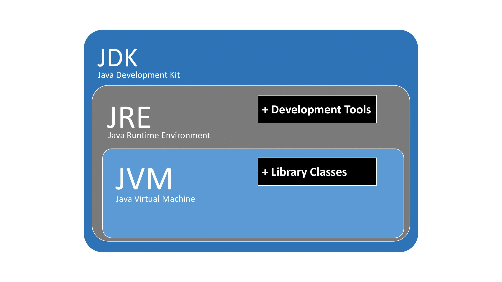
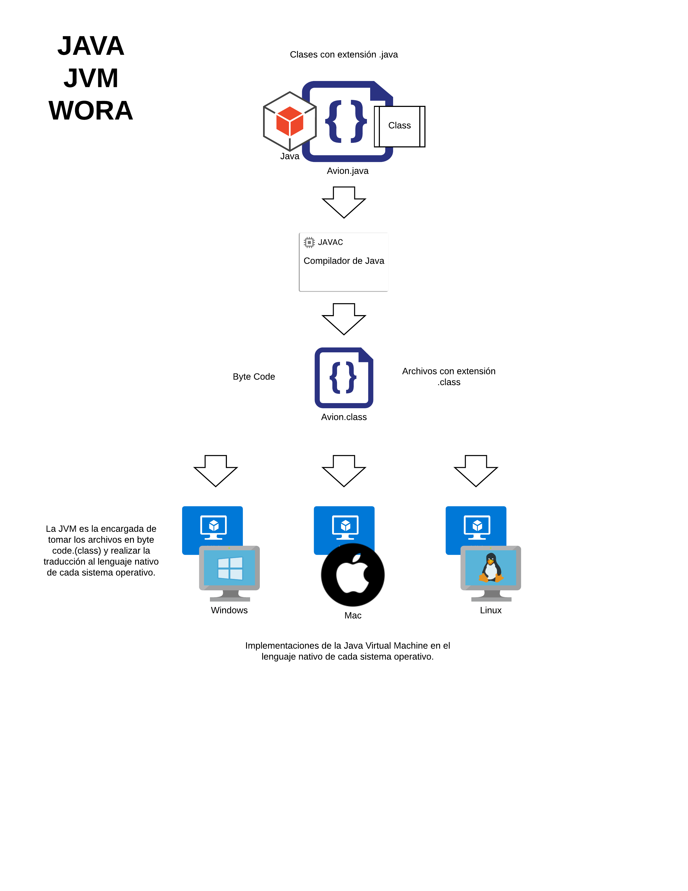
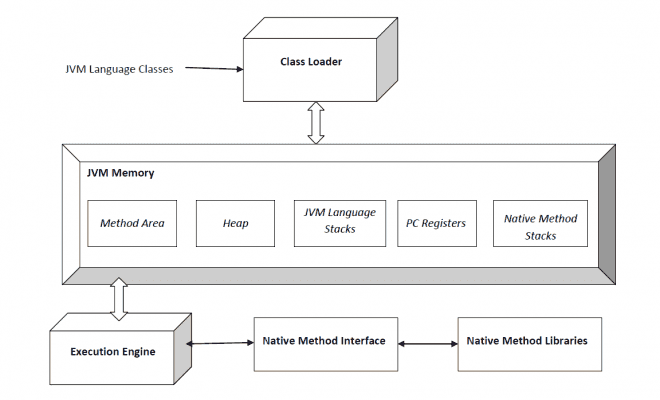

# Java Básico 2020 - Módulo I

### Programa
Conceptos generales de la programación orientada a objetos (POO). 
Encapsulamiento, herencia, polimorfismo y abstracción. 
Características del lenguaje Java. 
Java Virtual Machine (JVM) y Java Runtime Environment (JRE). 
Funcionamiento y características principales. 
Tipos de datos en Java. Operadores aritméticos.
Clases concretas, abstractas y estáticas. 
Modificadores de visibilidad.

## Programación orientada a objetos (POO)
La programación orientada a objetos es un paradigma que surge como solución a problemas comunes, entre ellos estaban:
- Reutilización del código fuente
- Mantenimiento del código fuente
- Adaptación a cambios que surgieran durante el desarrollo

Se introduce una nueva forma de organizar el código de un programa, agrupándolo por objetos, que en sí son elementos individuales que contienen funciones e información.

### Conceptos fundamentales
- Encapsulamiento
- Herencia
- Polimorfismo
- Abstracción

### Encapsulamiento

Este concepto es uno de los mas importantes en términos de seguridad. El encapsulamiento es la forma de proteger nuestros datos dentro del sistema estableciendo los permisos, niveles de visibilidad y acceso a los datos que fluyen dentro de la aplicación.

En Java existen 3 niveles:

- *public*: Se puede acceder a todos los atributos o métodos de la clase. 
- *protected*: Se puede acceder a los atributos o métodos solo en la misma jerarquía de herencia o dentro del mismo paquete. 
- *private*: Solo se puede acceder a los atributos o métodos de la clase en la que se encuentran.

### Herencia

Es el mecanismo por el cual una clase permite heredar las características (atributos y métodos) de otra clase. 
Una clase que se hereda se denomina superclase. La clase que hereda se llama subclase.

### Polimorfismo

Se refiere a la propiedad por la que es posible enviar mensajes sintácticamente iguales a objetos de tipos distintos. El único requisito que deben cumplir los objetos es saber responder al mensaje que se les envía. 

### Abstracción

Pensar en términos de objetos es muy parecido a cómo lo haríamos en la vida real. Una analogía sería modelizar un auto en un esquema de POO. Diríamos que el auto es el elemento principal que tiene una serie de características, como podrían ser el color, el modelo o la marca. La capacidad de reconocer los elementos comúnes y generalizarlos es lo que llamamos justamente abstracción.

# Introducción a Java

Java es un lenguaje de programación de propósito general, tipado, orientado a objetos que permite el desarrollo desde 
aplicaciones básicas, pasando por aplicaciones empresariales hasta aplicaciones móviles.
Java nacía como un lenguaje de programación que pudiese ser multiplataforma y multidispositivo, bajo el paradigma “Write Once Run Anywhere” (WORA)
De esta forma un programa Java escrito una vez podemos ejecutarle sobre diferentes plataformas, siendo soportados varios sistemas operativos. Y a su vez en diferentes tipos de dispositivos.
Para poder seguir este paradigma la compilación de un programa Java no genera código fuente, si no que genera bytecodes. Estos bytecodes son interpretados por una máquina virtual o JVM (Java Virtual Machine). Dicha máquina ya está escrita para cada uno de los sistemas operativos en cuestión.

### Características del lenguaje Java

Dentro de las características del lenguaje Java encontramos:

- Independiente de Plataforma: Cuando compilamos código fuente Java no se genera código máquina específico, si no que se generan bytecodes, los cuales son interpretados por la Java Virtual Machine (JVM), posibilitando que un mismo código fuente pueda ser ejecutado en múltiples plataformas.

- Orientado a Objetos: Cualquier elemento del lenguaje Java es un objeto (excepto los tipos primitivos). Dentro de los objetos se encapsulan los datos, los cuales son accedidos mediante métodos.

- Sencillo: Java está enfocado para ser un lenguaje fácil de aprender. Simplemente se deberán de entender los conceptos básicos de la programación orientada a objetos (POO).

- Seguro: Es seguro ya que los programas se ejecutan dentro de la Java Virtual Machine (JVM) en un formato de “caja de arena” (sandbox), de tal manera que no pueden acceder a nada que esté fuera de ella.
Tiene una validación sobre los bytecodes para comprobar que no hay códigos de fragmento ilegal.

- Arquitectura Neutral: Independientemente de que se ejecute en una arquitectura de 32bits o de 64bits. En Java los tipos de datos siempre ocupan lo mismo.

- Portable: Java no tiene nada que dependa de la plataforma, lo cual le hace que sea portable a diferentes plataformas.

- Robusto: El lenguaje Java intenta controlar las situaciones de error en los procesos de compilación y de ejecución, reduciendo de esta manera el riesgo de fallo.
Además Java realiza el control total de la memoria alocándola y retirandola mediante un garbage collector, de tal manera que no podemos utilizar punteros para acceder a ella.

- Multi-hilo: Java nos permite la programación concurrente, de tal manera que un único programa puede abrir diferentes hilos de ejecución.

- Interpretado: Los bytecodes son interpretados en tiempo real a código máquina.

- Alto Rendimiento: Java ofrece compiladores Just-In-Time que permiten tener un alto rendimiento.

- Distribuido: El lenguaje Java está pensando para ser ejecutado en arquitecturas distribuidas, como puede ser Internet.

# JRE
En su forma más simple, el entorno en tiempo de ejecución de Java está conformado por una Máquina Virtual de Java o JVM, un conjunto de bibliotecas Java y otros componentes necesarios para que una aplicación escrita en lenguaje Java pueda ser ejecutada. El JRE actúa como un "intermediario" entre el sistema operativo y Java. 

Un usuario sólo necesita el JRE para ejecutar las aplicaciones desarrolladas en lenguaje Java, mientras que para desarrollar nuevas aplicaciones en dicho lenguaje es necesario un entorno de desarrollo, denominado JDK, que además del JRE (mínimo imprescindible) incluye, entre otros, un compilador para Java. 

# Java Virtual Machine (JVM)

La Java Virtual Machine (JVM) recibe el código Byte Code obtenido de la compiliación de una determinada aplicación Java y la recompila en tiempo real al código nativo de la plataforma en que se está ejecutando.

JVM es la que realmente llama al método principal presente en un código Java. JVM es una parte del JRE (Java Run Environment).

### Class Loader

El subsistema de carga de clases posee una jerarquía de funcionamiento. Existen 3 tipo de cargadores:
 - Bootstrap ClassLoader : Carga las clases de /lib del JRE
 - Extensions ClassLoader : Carga las clases de /lib/ext de JRE
 - System ClassLoader : Carga el classpath. También llamado Application ClassLoader
 
Es responsable de 3 actividades:
 - Carga
 - Enlace
 - Inicialización

### Carga

El cargador de clases lee el archivo .class, genera los datos binarios correspondientes y los guarda en el área de métodos (“method area”). Para cada archivo .class, JVM almacena la siguiente información en el área de método.

- Nombre completamente calificado de la clase cargada y su clase primaria inmediata.
- Si el archivo .class está relacionado con Class o Interface o Enum
- Información sobre modificadores, variables, métodos, etc.

Después de cargar el archivo .class, JVM crea un objeto de tipo Class para representar este archivo en la memoria heap. Tenga en cuenta que este objeto es de tipo Class predefinido en el paquete java.lang. Este objeto Class puede ser utilizado por el programador para obtener información de nivel de clase como nombre de clase, nombre principal, métodos e información de variable, etc. Para obtener esta referencia de objeto, podemos usar el método getClass() de la clase Object.

### Vinculación o Enlace

Realiza la verificación, la preparación y (opcionalmente) la resolución.

- Verificación: asegura la exactitud del archivo .class, es decir, comprueba si este archivo está formateado correctamente y generado por un compilador válido o no. Si la verificación falla, obtenemos la excepción de tiempo de ejecución java.lang.VerifyError.
- Preparación: JVM asigna memoria para las variables de clase e inicializa la memoria a los valores predeterminados.
- Resolución: es el proceso de reemplazar referencias simbólicas del tipo con referencias directas. Se realiza buscando en el área del método (method area) para localizar la entidad a la que se hace referencia.

### Inicialización

En esta fase, todas las variables estáticas se asignan con sus valores definidos en el código y en el bloque estático (si corresponde). Esto se ejecuta de arriba a abajo en una clase y de padres a hijos en la jerarquía de clases.

En general, hay tres cargadores de clase (class loaders):

- Cargador de clases Bootstrap (Bootstrap class loader): cada implementación de JVM debe tener un cargador de clases de arranque, capaz de cargar clases confiables. Carga las clases API centrales de java presentes en el directorio JAVA_HOME/jre/lib. Esta ruta se conoce popularmente como ruta de arranque. Se implementa en lenguajes nativos como C, C++.
- Cargador de clases de extensiones (Extension class loader): es un elemento secundario del Bootstrap class loader. Carga las clases presentes en los directorios de extensiones JAVA_HOME/jre/lib/ext (Ruta de extensión) o cualquier otro directorio especificado por la propiedad del sistema java.ext.dirs. Está implementado en Java por la clase sun.misc.LauncherExt`$`ClassLoader.
- Cargador de clases de sistema/aplicación (system/Application class loader): es secundario del cargador de clases de extensión. Es responsable de cargar las clases desde la ruta de la clase de aplicación. Internamente utiliza la variable de entorno asignada a java.class.path. También se implementa en Java mediante la clase sun.misc.Launcher$AppClassLoader.

### Memoria JVM

- Área de método (Method area): en el área de método, se almacena toda la información del nivel de clase, como el nombre de clase, el nombre inmediato de la clase principal, la información de métodos y variables, etc., incluidas las variables estáticas. Solo hay un área de método por JVM, y es un recurso compartido.
- Área Heap (Heap area): la información de todos los objetos se almacena en el área heap. También hay un área heap por JVM. También es un recurso compartido.
- Área de pila (Stack area): para cada subproceso, JVM crea una pila en tiempo de ejecución que se almacena aquí. Cada bloque de esta pila se llama registro de activación/marco de pila que almacena los métodos de llamadas. Todas las variables locales de ese método se almacenan en su marco correspondiente. Una vez que finaliza un hilo, JVM destruirá la pila en tiempo de ejecución. No es un recurso compartido.
- Registros de PC (PC Registers): Almacena la dirección de la instrucción de ejecución actual de un hilo. Obviamente, cada hilo tiene registros de PC separados.
- Pilas de métodos nativos (Native method stacks): para cada hilo, se crea una pila nativa separada. Almacena información del método nativo.

### Motor de ejecución (Execution Engine)

El motor de ejecución ejecuta .class (bytecode). Lee el código de bytes línea por línea, usa datos e información presente en varias áreas de memoria y ejecuta instrucciones. Se puede clasificar en tres partes:

- Intérprete: interpreta el bytecode línea por línea y luego lo ejecuta. La desventaja aquí es que cuando se llama un método varias veces, cada vez se requiere interpretación.
- Compilador Just-In-Time (JIT): se usa para aumentar la eficiencia del intérprete. Compila todo el bytecode y lo cambia a código nativo para que cada vez que el intérprete vea llamadas a métodos repetidos, JIT proporcione código nativo directo para esa parte, de modo que la reinterpretación no es necesaria, por lo tanto, se mejora la eficiencia.
- Recolector de basura: destruye objetos no referenciados.

### Tipos de datos en Java
La principal diferencia entre tipos primitivos y objetos es la complejidad que presenta cada uno. Podriamos decir que un objeto esta 
formado por un conjunto de datos primitivos.

#### Operadores aritméticos de Java

### Clases concretas, estáticas y abstractas

Una clase es una plantilla que define la forma de un objeto. Los objetos son instancias de una clase.

### Clase Abstracta (abstract class)

Son clases que no pueden ser instanciadas, es decir, no se pueden crear objetos a partir de ellas. Sirven como superclases para sus clases hijas.

Sus características son:
 - No tienen cuerpo (llaves): sólo constan de signatura con paréntesis.
 - Su signatura termina con un punto y coma.
 - Los métodos abstractos sólo pueden existir dentro de una clase abstracta. De esta forma se evita que haya métodos que no se puedan ejecutar dentro de clases concretas. Visto de otra manera, si una clase incluye un método abstracto, forzosamente la clase será una clase abstracta.
 - Los métodos abstractos forzosamente habrán de estar sobreescritos en las subclases. Si una subclase no implementa un método abstracto de la superclase tiene un método no ejecutable, lo que la fuerza a ser una subclase abstracta. Para que la subclase sea concreta habrá de implementar métodos sobreescritos para todos los métodos abstractos de sus superclases.

### Clase Estática (static class)

La directiva static permite el acceso a métodos y variables de clase sin la necesidad de instanciar un objeto de dicha clase, permitiendo la inicialización de forma cómoda y durante la carga de clase. Además, los import estáticos mejoran la legibilidad de nuestro código, así como las clases estáticas internas la cohesión. 

