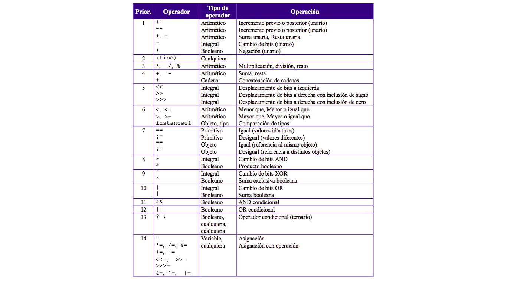

# Java Básico 2020 - Módulo II

### Programa
Orden de precedencia. Utilización de variables locales y globales. Clases y objetos. Subrutinas o métodos. Métodos constructores y sobrecarga de constructores.
Herencia de clases, superclase y subclase. Punteros y referencias a objetos. Interfaces.
Clases concretas, abstractas y estáticas. 
Modificadores de visibilidad.

## Orden de precedencia entre operadores
Al igual que en matemáticas, en Java existe un orden a la hora de realizar determinadas operaciones. Cada operador
tiene cierto grado de precedencia frente a otros. Veamos la tabla.

### Variables locales y globales (de instancia) 
Se entiende por variable local a aquellas que son declaradas y utilizadas dentro de un método. Cuando el ciclo de vida del 
método llega a su fin todo su contenido es borrado.

Por otro lado las variables de instancia son aquellas que forman parte de los atributos de un objeto. Permanecen ligadas a éste
hasta que es destruido.

### Clases concretas, estáticas y abstractas

Una clase es una plantilla que define la forma de un objeto. Los objetos son instancias de una clase.

### Clase Abstracta (abstract class)

Son clases que no pueden ser instanciadas, es decir, no se pueden crear objetos a partir de ellas. Sirven como superclases para sus clases hijas.

Sus características son:
 - No tienen cuerpo (llaves): sólo constan de signatura con paréntesis.
 - Su signatura termina con un punto y coma.
 - Los métodos abstractos sólo pueden existir dentro de una clase abstracta. De esta forma se evita que haya métodos que no se puedan ejecutar dentro de clases concretas. Visto de otra manera, si una clase incluye un método abstracto, forzosamente la clase será una clase abstracta.
 - Los métodos abstractos forzosamente habrán de estar sobreescritos en las subclases. Si una subclase no implementa un método abstracto de la superclase tiene un método no ejecutable, lo que la fuerza a ser una subclase abstracta. Para que la subclase sea concreta habrá de implementar métodos sobreescritos para todos los métodos abstractos de sus superclases.

### Clase Estática (static class)

La directiva static permite el acceso a métodos y variables de clase sin la necesidad de instanciar un objeto de dicha clase, permitiendo la inicialización de forma cómoda y durante la carga de clase. Además, los import estáticos mejoran la legibilidad de nuestro código, así como las clases estáticas internas la cohesión. 

### Métodos
Los métodos son bloques de código bien definidos que contienen operaciones sobre los datos de entrada denominados *parámetros*, pueden tener un tipo de retorno definido o no.

Lista de parámetros: si los hay deben ser declarados respetando la secuencia: tipo de dato + nombre

    tipo de retorno + nombre del método ( lista de parámetros separados por ",") { 
    operaciones;
    return 
    }

Ejemplos:

    void imprimirMensaje() {
        System.out.print("Curso Java");
    }
    
    float dividir(int dividendo, int divisor) {
        float cociente = dividendo / divisor;
        
        return cociente;
    } 

### Métodos constructores
Los métodos constructores son métodos especiales que solo pueden ser invocados al momento de instanciar un objeto. 
Se invocan utilizando la palabra reservada "new" y devuelven una referencia a la ubicación en memoria del objeto que estan
creando. Si no declaramos un método constructor en nuestra clase, el compilador agrega uno por default para que podamos crear
el objeto en cuestión.

Podemos tener varios constructores: con parámetros y sin parámetros.

#### Carga de datos por consola: Utilizando un objeto de la clase Scanner

    Scanner consola = new Scanner(System.in);
    String valorIngresadoPorConsola = consola.nextLine();  
